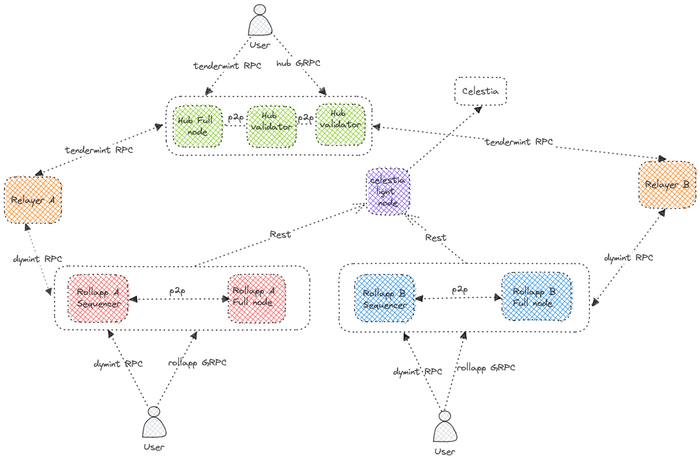

# Run a local network




## Overview

This directory contains the necessary files to run a dymension network locally using [docker-compose](https://docs.docker.com/compose/gettingstarted/).

## Running the network

```
docker-compose down -v && docker-compose pull && docker-compose up --build --force-recreate 
```
